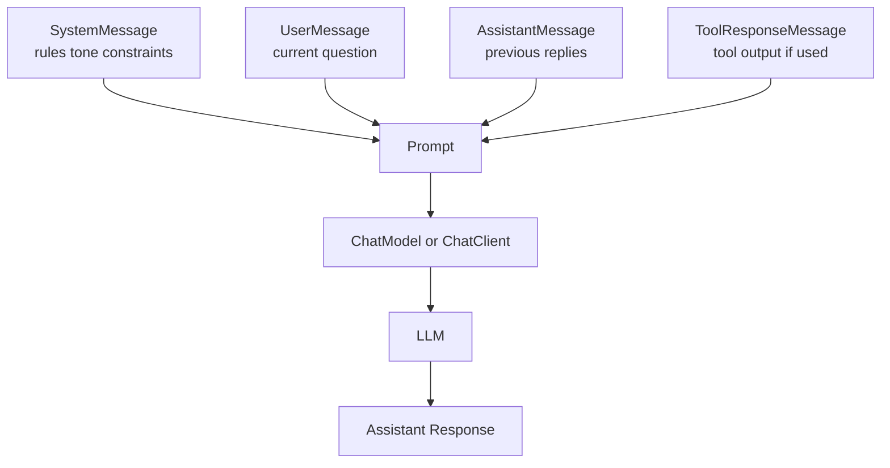
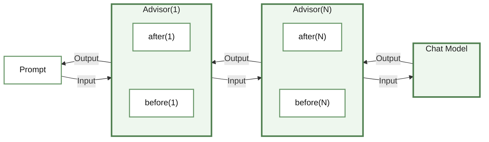
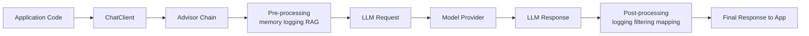
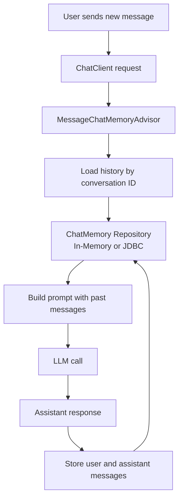
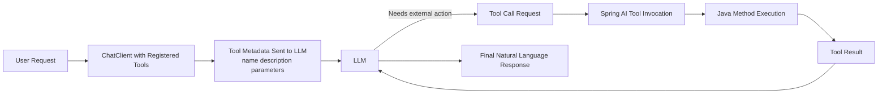



# Spring AI

### Table of Contents

- [Introduction to Spring AI](#introduction-to-spring-ai)
- [Get Started With Spring AI](#get-started-with-spring-ai)
- [Prompts](#prompts)
- [Advisors in Spring AI](#advisors-in-spring-ai)
- [Chat Memory](#chat-memory)
- [Function Calling in LLMs](#function-calling-in-llms)

## Introduction to Spring AI

**Spring AI** is a framework in the Spring ecosystem that helps Java developers integrate **AI models** into their applications by using familiar Spring patterns and abstractions.

Instead of calling each AI provider directly through its own API, Spring AI gives you a more consistent way to work with models such as OpenAI, Anthropic, Google, Azure OpenAI, and Ollama.

If you already know Spring Boot, dependency injection, and configuration properties, Spring AI feels natural because it follows the same design principles:

* Simplicity
* Reusability
* Portability across providers

In short, Spring AI makes it easier to build AI-powered Java applications without writing vendor-specific integration code.

---

## What Problem Does Spring AI Solve?
Working directly with AI providers can be difficult because:

- Each provider has its own APIs and request formats
- You often end up writing repetitive integration code
- Switching between providers may require significant refactoring

Spring AI solves these problems by providing a **unified API** for common AI tasks.

That means you can keep your application code cleaner, change providers more easily, and even combine multiple providers in the same system when needed.

---

## Features

Spring AI supports major AI providers such as Anthropic, OpenAI, Azure OpenAI, Amazon Bedrock, Google, and Ollama.

It also supports several common model types:

- **Chat / Conversational AI**  
  Used to build chatbots, assistants, and question-answering features.

- **Text-to-Image Generation**  
  Converts a text description into an image.

- **Audio Transcription (Speech-to-Text)**  
  Converts spoken audio into written text.

- **Text-to-Speech Synthesis**  
  Converts written text into natural-sounding speech.

- **Embeddings Generation**  
  Converts text into numerical vectors for semantic search, recommendations, and RAG applications.

### Portable API Support

You can connect to different AI providers by using the **same application structure**.

**Why this matters:**

* You can switch providers more easily
* Your code stays clean and maintainable

---

### Prompt Templates

Instead of building prompts manually every time, you can use **templates**.

**Example:**

```text
"Explain {topic} in simple terms"
```

Then you replace `{topic}` with a value such as `"Java Streams"`.

**Why this matters:**

* Makes prompts reusable
* Keeps your code organized

---

### Structured Output (POJOs)

AI responses can be converted directly into **Java objects (POJOs)** instead of raw text.

**Why this matters:**

* Easier to work with results in your code
* No need to manually parse text

---

### Vector Database Support (for RAG)

Spring AI works with **vector databases**, which help applications search and retrieve relevant information from their own data.

This is commonly used in **RAG (Retrieval-Augmented Generation)**:

* The AI looks up relevant information
* Then uses it to give better answers
* It uses semantic search, so results are based on meaning and not only exact keyword matches

**Why this matters:**

* You can build smarter apps (chatbots, search tools, assistants)
* The model can answer with your own business data in context

---

### Tool Calling

AI models can call your **Java methods (functions)** when needed.

**Example:**

* AI receives: "What's the weather?"
* It calls your Java function that fetches real weather data

**Why this matters:**

* Connects AI to real-world logic
* Makes applications more powerful and interactive

---

Spring AI is a **bridge between Spring applications and modern AI capabilities**.

It helps you:

* Integrate AI faster
* Keep your code cleaner
* Reduce vendor lock-in
* Build smarter, data-driven applications

### How Spring AI Works

At a high level, Spring AI sits between your Spring application and the model provider. Your code builds a prompt, optional advisors enrich it, the provider executes the request, and Spring AI maps the answer back into text, streams, or Java objects.


---
## Get Started with Spring AI

### Step 1: Add Spring AI to your project

**Maven:**
```xml
<dependency>
    <groupId>org.springframework.ai</groupId>
    <artifactId>spring-ai-openai-spring-boot-starter</artifactId>
</dependency>
```

**Gradle:**
```gradle
implementation 'org.springframework.ai:spring-ai-openai-spring-boot-starter'
```

### Step 2: Configure API Key

Add your API key in `application.properties` or `application.yml`.

**application.properties:**
```properties
spring.ai.openai.api-key=YOUR_API_KEY
```

**application.yml:**
```yaml
spring:
  ai:
    openai:
      api-key: ${OPENAI_API_KEY}
```

### Example 1: Simple Chat

Spring AI offers two ways to interact with AI models: a low-level `ChatModel` API and a high-level `ChatClient` API.

#### Example 1.1: Using `ChatModel` (Low-level API)

The `ChatModel` is the primary interface for interacting with an AI model. It provides a more direct way to send prompts and receive responses.

```java
@Service
public class OpenAIServiceImpl implements OpenAIService {

    private final OpenAiChatModel chatModel;

    public OpenAIServiceImpl(OpenAiChatModel chatModel) {
        this.chatModel = chatModel;
    }

    public String processSimpleChatQuery(String query) {
        // Simple call with a string
        return chatModel.call(query);
    }
}
```

#### Example 1.2: Using `ChatClient` (High-level API)

The `ChatClient` is a more modern, fluent API that simplifies interactions by providing a builder-style interface and built-in support for advisors, conversion, and more.

```java
@Service
public class OpenAIServiceImpl implements OpenAIService {

    private final ChatClient chatClient;

    public OpenAIServiceImpl(ChatClient.Builder builder) {
        this.chatClient = builder.build();
    }

    public String processSimpleChatQuery(String query) {
        return chatClient.prompt()
                .user(query)
                .call()
                .content();
    }
}
```

### Example 2: Streaming Chat with Flux

Instead of waiting, we stream the response word-by-word using `Flux<String>`.

```java
public Flux<String> processSimpleChatQueryStream(String query) {
    return chatClient.prompt()
            .user(query)
            .stream()
            .content();
}
```

### Example 3: Structured Data (Travel Guide)

Using `BeanOutputConverter` to get a Java Object directly from the AI.

```java
public TravelGuideResponse generateTravelGuideJson(TravelParameters params) {
    // 1. Prepare the converter for our POJO
    BeanOutputConverter<TravelGuideResponse> converter = new BeanOutputConverter<>(TravelGuideResponse.class);

    // 2. Build the request
    return chatClient.prompt()
            .system("You are a professional travel assistant. " + converter.getFormat())
            .user("Create a travel guide for " + params.city())
            .call()
            // 3. Automatically convert response to the POJO
            .entity(TravelGuideResponse.class);
}
```

---

## Prompts

In Spring AI, a **Prompt** is a structured request sent to the AI model. It is composed of one or more **Messages**, each with a specific **Role**.

The important idea is that a prompt is usually more than "just one string". Spring AI packages conversation context and instructions into an ordered list of messages that the model reads together.

### Message Roles

| Role          | Class                 | Description                                                  |
|:--------------|:----------------------|:-------------------------------------------------------------|
| **System**    | `SystemMessage`       | Sets the AI's persona, behavior, and "ground rules".         |
| **User**      | `UserMessage`         | The actual input or question from the user.                  |
| **Assistant** | `AssistantMessage`    | The AI's previous responses (used for conversation history). |
| **Tool**      | `ToolResponseMessage` | The output from a Java function called by the AI.            |

### Prompt Composition Flow

This diagram shows how Spring AI combines different message types into one prompt before sending it to the model.



---

### 1. System Prompt
The **System Prompt** (or System Message) is used to set the behavior, persona, or constraints of the AI model. It acts as the "governing" instructions that the AI follows during the conversation.

#### Why use System Prompts?
- **Define Persona:** Tell the AI to act as a "Travel Assistant", "Senior Java Developer", or "History Teacher".
- **Set Tone:** Make the response "professional", "funny", or "concise".
- **Enforce Constraints:** "Do not use technical jargon" or "Only respond in bullet points".

---

### 2. User Prompt
The **User Prompt** (or User Message) represents the direct input from the end user. This is what the AI is asked to respond to in the context of the System Prompt.

#### Why use User Prompts?
- **Ask Questions:** "What is the capital of France?"
- **Provide Data:** "Summarize this text: [long text here]"
- **Give Instructions:** "Write a Java method that calculates the Fibonacci sequence."

---

### Example 2.1: Using `ChatModel` (Low-level API)

To use prompts with the `ChatModel`, you manually create message objects and wrap them in a `Prompt`.

```java
public String getTravelAdvice(String city) {
    // 1. Define System Role
    SystemMessage systemMessage = SystemMessage.builder()
            .text("You are a professional travel assistant. Help users plan trips to " + city + ".")
            .build();

    // 2. Define User Input
    UserMessage userMessage = new UserMessage("What should I see?");

    // 3. Combine into a Prompt
    Prompt prompt = new Prompt(List.of(systemMessage, userMessage));

    // 4. Call the model
    return chatModel.call(prompt).getResult().getOutput().getContent();
}
```

### Example 2.2: Using `ChatClient` (High-level API)

The `ChatClient` provides a much simpler, fluent way to define both system and user prompts.

```java
public String getTravelAdvice(String city) {
    String systemText = """
            You are a professional travel assistant.
            Your role is to help users plan trips to {city}.
            Guidelines:
            - Be friendly and concise.
            - Suggest real-world recommendations.
            """;

    return chatClient.prompt()
            .system(sp -> sp.text(systemText).param("city", city)) // System Message
            .user("What should I see?")                           // User Message
            .call()
            .content();
}
```

---

## Advisors in Spring AI

**Advisors** are reusable components that participate in the lifecycle of a `ChatClient` call.

- **Prompts** define what you want to ask
- **Advisors** shape how the request is prepared and processed
- **Tools** execute real business logic

Advisors act like **middleware / interceptors** around the AI request.
They can inspect, enrich, log, validate, or block a request before it reaches the model, and they can also inspect or transform the response before it is returned to your application.

### Why Advisors
- **Cross-cutting concerns:** Add functionality like logging, safety, or memory without cluttering service methods.
- **Request/response enrichment:** Inject more context into the prompt or inspect the result after the model responds.
- **Consistency:** Apply the same behavior to every request instead of repeating the same code manually.
- **Separation of responsibilities:** Keep retrieval, memory, observability, and safety separate from business logic.

### What Advisors
- **Guard the request:** Block obviously unsafe or sensitive input before it reaches the model.
- **Add memory:** Load recent conversation history so follow-up questions still make sense.
- **Add retrieved knowledge:** Fetch relevant chunks from a vector store and inject them into the prompt for RAG.
- **Log and observe:** Capture request/response details for debugging, tracing, or metrics.
- **Post-process output:** Inspect or adjust model output before it is returned to the application.

### Common Advisor Types
- **MessageChatMemoryAdvisor:** A memory advisor that automatically loads earlier messages into the next prompt and stores the new exchange after the response.
- **QuestionAnswerAdvisor:** A retrieval advisor that searches a vector store for relevant documents and injects them into the prompt for RAG.
- **SimpleLoggerAdvisor:** A debugging advisor that logs request and response information so you can observe what goes through the AI pipeline.
- **SafeGuardAdvisor:** Blocks requests that contain configured sensitive or unsafe terms.



### Advisors vs. Tools vs. Vector Store

- **Advisor:** The mechanism that prepares or wraps the AI call
- **Tool:** A Java method the model can call to perform a real action
- **Vector Store:** The knowledge storage used for semantic search

This distinction is important in architecture:

- Advisors prepare and guide the model call
- Tools perform business actions
- Vector stores provide external knowledge

### Advisor Execution Flow

Advisors wrap around the normal chat call. They typically enrich the request before it reaches the model, then optionally inspect or transform the response on the way back.

You can think of the flow like this:

1. Application builds a prompt
2. Advisors run in order
3. The model receives the final enriched request
4. The response passes back through the advisor chain
5. The application receives the final result



### Advisor Order Matters

When multiple advisors are registered, the order changes behavior.

A practical order is:

1. **Safety advisor first**
   Stops bad or sensitive input early
2. **Logging advisor early or around the chain**
   Helps observe what enters and leaves the pipeline
3. **Memory advisor**
   Adds recent conversation context
4. **RAG / retrieval advisor**
   Adds relevant external knowledge

For example, in an event chatbot:

- `SafeGuardAdvisor` can block secrets or sensitive input
- `MessageChatMemoryAdvisor` can remember previous turns
- `QuestionAnswerAdvisor` can retrieve cancellation policy text from a vector store
- Tool calling can then perform real actions such as registration or removal

This gives a clean architecture:

- **Advisors** for preparation and control
- **Memory** for continuity
- **RAG** for business knowledge
- **Tools** for real operations

### How to Register an Advisor
You can add advisors globally to a `ChatClient` during its construction or per-request.

```java
// 1. Global (default) advisor
this.chatClient = builder
        .defaultAdvisors(
        MessageChatMemoryAdvisor.builder(chatMemory).build(),
                new SimpleLoggerAdvisor()
        )
                .build();

// 2. Per-request advisor
this.chatClient.prompt()
        .advisors(new SimpleLoggerAdvisor())
        .user("Hello!")
        .call();
```

---

## Chat Memory

**Chat Memory** is the mechanism that allows an AI model to maintain context across multiple interactions. To understand it fully, we must distinguish between two key concepts:

### Chat Memory vs. Chat History

| Concept          | Definition                                                                                | Analogy                                                           |
|:-----------------|:------------------------------------------------------------------------------------------|:------------------------------------------------------------------|
| **Chat History** | The actual list of messages (User and AI) that have been exchanged during a conversation. | The transcript of a recording.                                    |
| **Chat Memory**  | The component/strategy that stores, manages, and provides the history back to the AI.     | The person's ability to recall relevant parts of that transcript. |

**How they work together:**
When a user sends a new message, Spring AI uses a **Chat Memory** component to retrieve the relevant **Chat History** and include it in the new request. This "context" allows the AI to understand pronouns (like "it" or "that") and follow-up questions.

### Chat Memory Flow

This is the typical runtime cycle: Spring AI stores messages after each exchange, then fetches recent history and injects it back into the next prompt.



### Why use Chat Memory?
- **Conversation Context:** Enables follow-up questions (e.g., "Tell me more about *that*").
- **Personalization:** Remembers user preferences shared earlier in the chat.
- **Continuity:** Maintains a natural dialogue flow.

### Storage Options (In-Memory vs. JDBC)

Spring AI provides different ways to store chat history depending on your needs:

#### 1. In-Memory Storage (`MessageWindowChatMemory`)
The simplest way to store messages. It keeps everything in the application's RAM.
- **Pros:** Extremely fast, no database setup required.
- **Cons:** History is lost when the application restarts.
- **When to use:** For testing, demos, or applications where persistence isn't critical.

#### 2. Persistent Storage (`JdbcChatMemoryRepository`)
Stores messages in a relational database (like MySQL, PostgreSQL, or H2).
- **Pros:** History survives application restarts; can be shared across multiple server instances.
- **Cons:** Requires database configuration and management.
- **When to use:** For production applications where users expect their chat history to be preserved.


You can switch between In-Memory and JDBC storage by changing how you define your `ChatMemory` bean.

**Using JDBC (Recommended for Production):**
```java
@Configuration
public class AIConfig {

    @Bean
    public ChatMemory chatMemory(ChatMemoryRepository chatMemoryRepository) {
        return MessageWindowChatMemory.builder()
                .maxMessages(10) // Only remember the last 10 messages
                .chatMemoryRepository(chatMemoryRepository)
                .build();
    }

    @Bean
    public ChatMemoryRepository chatMemoryRepository(JdbcTemplate jdbcTemplate) {
        return JdbcChatMemoryRepository.builder()
                .jdbcTemplate(jdbcTemplate)
                .dialect(new MysqlChatMemoryRepositoryDialect())
                .build();
    }
}
```

**Using In-Memory (Simple):**
```java
@Bean
public ChatMemory chatMemory() {
    return MessageWindowChatMemory.builder()
            .maxMessages(10)
            .build();
}
```

### Implementation with `MessageChatMemoryAdvisor`

The `MessageChatMemoryAdvisor` is an advisor that can be added to the `ChatClient` to automatically handle the storage and retrieval of chat history.

```java
@Service
public class EventChatClient {

    private final ChatClient chatClient;

    public EventChatClient(ChatClient.Builder builder, ChatMemory chatMemory) {
        this.chatClient = builder
                .defaultAdvisors(
                        // Register the memory advisor with the ChatClient
                        MessageChatMemoryAdvisor.builder(chatMemory).build()
                )
                .build();
    }

    public String chat(String chatId, String message) {
        return this.chatClient.prompt()
                .user(message)
                .advisors(advisorSpec -> advisorSpec.param("chat_memory_conversation_id", chatId))
                .call()
                .content();
    }
}
```

---

## Function Calling in LLMs

**Function Calling** (also known as **Tool Calling**) allows an LLM to request the execution of a specific Java method during a conversation. This connects the AI to real-world data and logic that it wouldn't otherwise have access to.

### Architecture: How it Works

The interaction between the user, the LLM, and your Java application follows a specific architectural flow:

1.  **Request (Metadata Sharing):** When you register a tool, Spring AI sends the **method signature** and **description** (metadata) to the LLM as part of the initial prompt.
2.  **AI Decision:** The LLM analyzes the user's message. If it determines it needs more information or needs to perform an action, it responds with a **Tool Call Request** (instead of text).
3.  **Local Execution:** Spring AI intercepts this request, finds the corresponding Java method, and executes it with the parameters provided by the LLM.
4.  **Result Feedback:** The result of the Java method is sent back to the LLM.
5.  **Final Response:** The LLM processes the tool's result and provides a final, natural language answer to the user.

### Tool Calling Flow

This diagram shows the full loop: the model receives tool metadata, decides whether to call a tool, Spring AI executes the Java method, and the model uses that result to produce the final answer.



### The AI's Decision Process (How it "Decides")

The AI does NOT "see" your Java code. It only sees the **Description** you provide.

*   **Tool Descriptions:** The `@Tool(description = "...")` annotation is critical. It tells the AI *what* the tool does and *when* to use it.
*   **Parameter Names & Types:** The AI uses the names and types of your method parameters to figure out how to pass data (e.g., "eventId" or "participantEmail").
*   **Context Matching:** If a user says "Who is attending the Spring AI Workshop?", the AI matches "attending" and "Workshop" with your tool's description ("Get an event by its ID" or "Get all future events") to decide which one to call.

---

### Implementation Step-by-Step

### Example: Event Management Assistant

In this example, we build a professional **Event Management Assistant (EMA)** that can list events and manage participant registrations using tools.

```java
@Service
public class EventChatClient {
    private final ChatClient chatClient;

    public EventChatClient(ChatClient.Builder builder, ChatMemory chatMemory, EventService eventService) {
        this.chatClient = builder
                .defaultAdvisors(MessageChatMemoryAdvisor.builder(chatMemory).build())
                .defaultTools(eventService) // Registers the EventService as a tool
                .defaultSystem("""
                        Role: You are a professional Event Management Assistant (EMA).
                        Identity: Your name is EMA.
                        Context: You help users interact with the company's event system.
                        Primary Responsibilities:
                        - Show available events.
                        - Manage participation (add/remove participants).
                        Behavior Rules:
                        - Always include the Event ID when listing events.
                        - Mandatory Confirmation Step: Before calling any tool to add or remove a participant, summarize details and ask for explicit confirmation.
                        """)
                .build();
    }

    public String chat(String chatId, String message) {
        return this.chatClient.prompt()
                .user(message)
                .advisors(advisorSpec -> advisorSpec.param("chat_memory_conversation_id", chatId))
                .call()
                .content();
    }
}
```

**The Tool Implementation (`EventServiceImpl`):**

```java
@Service
public class EventServiceImpl implements EventService {

    private final Map<String, Event> eventMap = new ConcurrentHashMap<>();

    @Override
    @Tool(description = "Get all future events")
    public Collection<Event> getAllEvents() {
        return eventMap.values().stream()
                .filter(event -> event.dateTime().isAfter(LocalDateTime.now()))
                .collect(Collectors.toList());
    }

    @Override
    @Tool(description = "Add a participant to an event by event ID and participant email")
    public void addParticipant(String eventId, String participantEmail) {
        // Implementation logic
    }
}
```

### Why use Function Calling?
- **Real-time Data:** Fetch the latest information (weather, stocks, database records).
- **Actions:** Perform operations (create an event, send an email, update a record).
- **Reliability:** Executes verified Java logic instead of the AI guessing or hallucinating facts.

